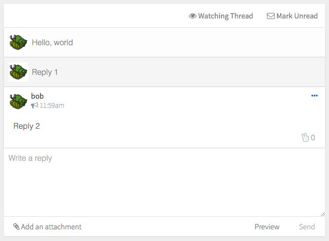

# Flat Message Thread

Flat rendering of message threads



```jsx
import Thread from 'patchkit-flat-msg-thread'

<Thread
  id={msgId}
  suggestOptions={app.suggestOptions}
  channels={app.channels}

  onMsgChange={onMsgChange}
  onNewReply={onNewReply}

  forceRootExpanded
  live />
```

Options:

  - `id`: Required string, the ID of the thread's root message.
  - `channels`: Channel suggestions (array of strings).
  - `suggestOptions`: Suggest-box suggestions (see [suggest-box](https://www.npmjs.com/package/suggest-box)).
  - `live`: Live update with replies to the thread?
  - `forceRaw`: Render all messages in the "raw" data-fields?
  - `forceRootExpanded`: Don't collapse the first message, even if it's been read?
  - `onDidMount`: Function called after first render.
  - `onMsgChange`: Function called after any changes to a message (flag, mark unread, upvote, etc).
  - `onNewReply`: Function called after the user adds a reply.
  - `onClose`: Function called when the user clicks on the header of the thread.

## Styles

Use the .less file:

```less
@import "node_modules/patchkit-flat-msg-thread/styles.less"
```